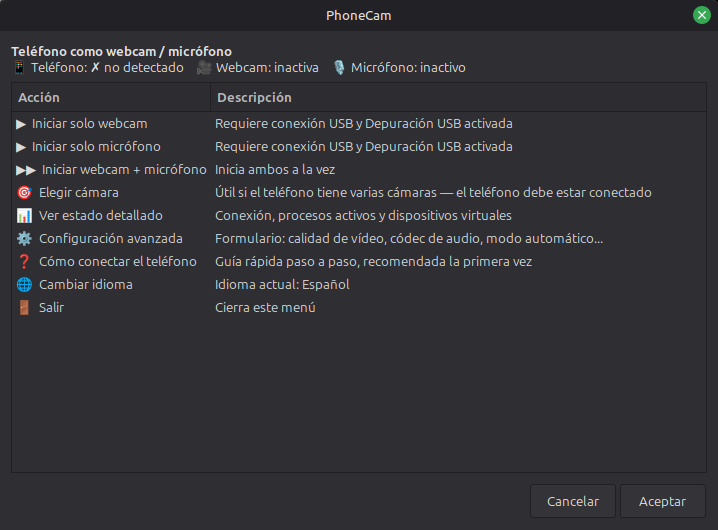
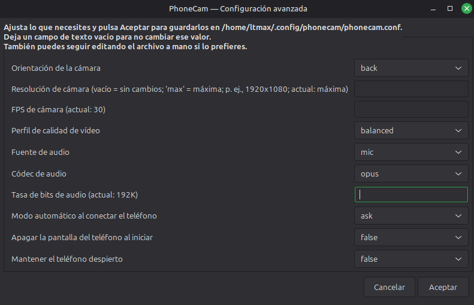
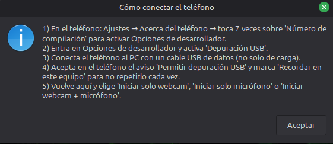

<p align="center">
  
</p>

# PhoneCam

[English version](README.md)

  

Convierte la cámara y el micrófono de tu Android en una webcam y un micrófono más de tu Linux Mint, por cable USB. Sin instalar nada en el teléfono, sin Wi-Fi, sin nube: todo se queda entre tu móvil y tu PC.

> **Idioma:** PhoneCam incluye interfaz en español e inglés. El idioma se detecta automáticamente a partir del locale del sistema (español si corresponde; inglés en cualquier otro caso) y también puede cambiarse al instante con `L` en el menú de texto, desde la opción de idioma del menú gráfico o con `phonecam l`.

## Novedades de la 1.1.0

- **Interfaz en español e inglés.** Menús, mensajes, instalador y ayuda hablan ahora los dos idiomas y siguen el idioma de tu sistema. Cámbialo cuando quieras con `phonecam l`, con `L` en el menú de texto o desde el menú gráfico.
- **Descarga de scrcpy más segura.** La build oficial se comprueba con su suma SHA-256 y el archivo se valida antes de extraerlo. La versión mínima de scrcpy pasa a ser la **2.3.1** (antes, la 2.2).
- **Fallos más claros.** Antes de arrancar, PhoneCam comprueba la versión de Android del teléfono (12+ para cámara, 11+ para micrófono) y exige que el audio funcione de verdad. Después le da a scrcpy 2 segundos (antes, 1; ajustable con `PHONECAM_START_GRACE`) para demostrar que sigue vivo y, si se cae, muestra el final de su registro en el propio error en vez de limitarse a señalar el archivo.
- **Control de pantalla por ADB.** `TURN_SCREEN_OFF` se aplica por ADB porque scrcpy desactiva el control en modo cámara; `KEEP_AWAKE` se aplica igual, y el valor anterior de Android en el móvil se restaura al terminar la captura.
- **Más robusto.** La configuración, el lanzador, el servicio y los archivos PID se escriben ahora de forma atómica, para que una escritura interrumpida no deje un archivo a medias. Además, el agente en segundo plano espera a que arranque tu sesión de escritorio.
- **Además:** `phonecam help-connection` (`ayuda` sigue funcionando), la fuente de audio `mic-voice-recognition` (scrcpy 3.2+), el icono de la app incluido en el propio script, capturas en los dos idiomas y una suite de tests de regresión (`bash tests/run_all.sh`, sin necesitar teléfono).

## Qué es

Para cualquier programa que elija cámara o micrófono —Zoom, Meet, Discord, OBS, Teams, el propio navegador— tu teléfono pasa a aparecer en la lista como una webcam cualquiera, sin que esa aplicación tenga que saber nada especial sobre PhoneCam ni sobre tu móvil.





Por dentro combina tres piezas ya existentes y las coordina desde un único script:

- **[scrcpy](https://github.com/Genymobile/scrcpy)** captura la cámara y el audio del teléfono por USB.
- **v4l2loopback** expone esa captura como un dispositivo de vídeo `/dev/video*` normal.
- **PipeWire/PulseAudio** expone el audio como un micrófono virtual normal.

PhoneCam no reinventa nada de eso: se encarga de instalarlo, conectarlo todo correctamente entre sí y ponerte un menú delante para que no tengas que recordar ni un solo comando.

Conectarlas bien es más que "encenderlas a la vez". Al iniciar la webcam, PhoneCam le pide a scrcpy solo la cámara —sin pantalla, sin control remoto, para no gastar recursos de más— y la vuelca en el dispositivo de v4l2loopback. Al iniciar el micrófono, le pide solo audio y enruta él mismo el flujo de sonido hasta el micrófono virtual; si no lo consigue en unos segundos, te avisa y te explica cómo terminarlo a mano en `pavucontrol`.

## Ventajas

- **Todo en un único archivo.** Instalador, desinstalador, CLI, agente en segundo plano, plantilla de configuración, lanzador `.desktop`, unidad `systemd --user` y hasta el icono de la aplicación viven en un solo `.sh`; el icono es el último bloque del archivo (base64 dentro de comentarios, nunca se ejecuta), así que una copia del script suelta lo instala todo. `assets/` solo guarda las imágenes del repositorio. Se lee de un tirón, se audita de un tirón y se copia donde haga falta sin arrastrar una carpeta de dependencias.
- **100% local.** Ni cuentas, ni nube, ni Wi-Fi entre el móvil y el PC: todo pasa por el cable USB vía ADB (Android Debug Bridge). Una vez instalado, funciona sin conexión a internet.
- **Nada que instalar en el teléfono.** No hay APK de por medio. PhoneCam usa la depuración USB que Android ya trae de fábrica en sus opciones de desarrollador.
- **Aparece como hardware de verdad.** La webcam es un `/dev/video*` estándar y el micrófono, un dispositivo PipeWire/PulseAudio normal. Cualquier programa que sepa elegir cámara o micrófono los ve directamente, sin integraciones ni plugins específicos.
- **Se encarga de scrcpy por ti.** El paquete `scrcpy` de los repositorios de Mint/Ubuntu puede quedarse por detrás de las funciones y la versión de upstream que necesita PhoneCam. Por eso no depende de ese paquete: comprueba la versión instalada y, si falta o se queda corta, descarga la build oficial más reciente desde los releases de GitHub y la deja lista en `~/.local/bin`, sin pedir sudo ni tocar el resto del sistema.
- **Detección automática, con bandeja del sistema si quieres.** Un agente en segundo plano vigila la conexión USB y arranca (o pregunta, o ignora) la webcam y el micrófono según el modo que elijas; al desconectar el teléfono, para la captura sola. Con `yad` instalado añade además un icono en la bandeja con acceso directo a todo. Más detalles en [Detección automática y bandeja del sistema](#detección-automática-y-bandeja-del-sistema).
- **El menú se adapta a lo que está pasando, no solo te dice qué falló.** Tanto en la versión gráfica (zenity) como en la de texto, la cabecera muestra de un vistazo si el teléfono está conectado y si la webcam o el micrófono ya están activos; las opciones cambian solas ("Detener webcam" en vez de "Iniciar" si ya está encendida, "Detener todo" solo si hay algo que detener) y cada una indica qué necesita el sistema antes de pulsarla. Si algo falla, aparece en una ventana de error en vez de perderse en una terminal que nadie mira; si sale bien, te enteras por una notificación aunque hayas cambiado de ventana.
- **La configuración se valida y se aplica al momento.** El formulario de configuración avanzada comprueba el formato de resolución, FPS y bitrate de audio antes de guardar nada, así que un valor mal escrito no se convierte más tarde en un fallo críptico de scrcpy. Un cambio guardado se aplica de inmediato a la sesión en marcha, sin tener que cerrar y volver a abrir el menú.
- **Pensado para no quedarse colgado ni pisarse a sí mismo.** Cualquier llamada a ADB tiene un límite de tiempo, así que un teléfono en mal estado o un servidor `adb` atascado no puede congelar el menú ni el agente. Antes de dar una webcam o un micrófono por activos, comprueba que el proceso siga siendo de verdad `scrcpy` y no un PID reciclado por otro programa; al detenerlos, espera a que cierren de verdad antes de devolver el control, para que un reinicio inmediato no se encuentre el dispositivo todavía ocupado.
- **Instala y reinstala sin pisar lo que ya tenías.** Si el número de dispositivo de vídeo que usa por defecto (`/dev/video42`) ya está ocupado por otra cámara o capturadora, PhoneCam elige automáticamente el siguiente libre. Reinstalar reutiliza ese número y la configuración que ya tenías —no la sobrescribe— y de paso vuelve a comprobar (y si hace falta, actualizar) scrcpy.
- **Desinstala con cuidado.** Quita el comando, el lanzador, el servicio y el micrófono virtual sin tocar los paquetes del sistema; solo borra el enlace a scrcpy si sigue apuntando a la copia que descargó PhoneCam (si pusiste tú tu propio scrcpy en su lugar, lo deja tal cual). Es capaz incluso de borrar limpiamente el propio archivo desde el que se está ejecutando, relanzándose primero desde una copia temporal. Para la webcam virtual (que sí necesita `sudo`) te deja los comandos exactos para revertirla. Más detalles en [Desinstalar](#desinstalar).
- **Funciona sin entorno gráfico completo.** Con `zenity` instalado tienes menús y formularios; sin él, cae automáticamente a un menú de texto igual de funcional. Ningún paso se queda bloqueado solo por faltar una herramienta gráfica.

## Compatibilidad

- **Sistema operativo:** pensado y probado en Linux Mint 22.3 (Cinnamon). El instalador depende de `apt`, así que cualquier base Ubuntu/Debian debería comportarse igual; en distribuciones sin `apt` (Fedora, Arch...) tendrás que instalar las dependencias a mano e invocar el script directamente, sin pasar por `install`.
- **Arquitectura:** la descarga automática de scrcpy apunta a la build estática oficial para Linux `x86_64`. En otras arquitecturas necesitas instalar scrcpy 2.3.1+ por tu cuenta; PhoneCam lo usará igual una vez esté en el `PATH`.
- **Teléfono:** cualquier Android con depuración USB. El modo cámara de scrcpy exige Android 12 o superior y la captura de micrófono, Android 11 o superior —es un límite del propio scrcpy, no algo que PhoneCam pueda saltarse—; por debajo de eso, scrcpy arranca pero la webcam o el micrófono no llegan a funcionar. Además, PhoneCam exige scrcpy 2.3.1 o superior en el PC para ambos modos; ese mínimo evita varios problemas de cámara documentados en versiones 2.x antiguas.
- **Privilegios:** no hace falta root en el teléfono. En el PC, `sudo` solo se pide durante la instalación (paquetes del sistema, módulo `v4l2loopback`, grupos `video`/`plugdev`); el resto —incluida la descarga de scrcpy— corre como usuario normal, salvo que te falten a la vez `curl` y `wget` al ir a descargar scrcpy (no debería pasarte tras una instalación normal, porque `curl` ya es una de las dependencias), en cuyo caso se ofrece instalar `curl` con `sudo` antes de seguir.

## Instalación

```bash
git clone https://github.com/filonux/PhoneCam.git
cd PhoneCam/script
chmod +x phonecam.sh
./phonecam.sh install
```

No lo ejecutes con `sudo`: el propio instalador lo pedirá cuando de verdad lo necesite. Si quieres una instalación desatendida (sin preguntas, salvo la contraseña de sudo del sistema), usa `./phonecam.sh install --yes`.

Durante la instalación, el script:

1. Instala por `apt` lo que hace falta: `adb`, `curl`, `v4l2loopback-dkms`, `v4l-utils`, `pipewire`, `pipewire-pulse`, `wireplumber`, `pulseaudio-utils`, `zenity`, `yad`, `libnotify-bin` y las cabeceras del kernel en uso.
2. Descarga scrcpy (la build oficial, no la de los repositorios) si no lo tienes o tu versión es demasiado antigua.
3. Configura `v4l2loopback` para que la webcam virtual sobreviva a un reinicio —si el número de dispositivo que usa por defecto ya está ocupado por otra cámara o capturadora, elige automáticamente el siguiente libre—, y añade tu usuario a los grupos `video` y `plugdev` si hace falta.
4. Se copia a sí mismo a `~/.local/bin/phonecam` y añade esa carpeta al `PATH` si no estaba ya.
5. Escribe una configuración por defecto (si no tenías una), instala el icono personalizado 1024×1024 RGBA y crea el lanzador de aplicaciones y el servicio `systemd --user` que detecta el teléfono automáticamente.

Dos cosas a tener en cuenta:

- Si te añadió a los grupos `video` o `plugdev`, tienes que **cerrar sesión y volver a entrar** (o reiniciar) para que el permiso surta efecto — hasta entonces, `/dev/video42` (o el número que se haya asignado) existirá pero no podrás escribir en él.
- Si tu equipo tiene **Secure Boot activado**, es probable que sea la primera vez que se compila un módulo de kernel por DKMS: puede que en el siguiente arranque aparezca la pantalla azul de "MOK Management", donde solo hay que aceptar el enrolamiento de la clave nueva.

Todo lo que crea la instalación queda aquí:

| Qué | Dónde |
| --- | --- |
| Comando instalado | `~/.local/bin/phonecam` |
| Configuración | `~/.config/phonecam/phonecam.conf` |
| Registros | `~/.local/share/phonecam/logs/` |
| Estado en ejecución (PID y locks de arranque por modo) | `$XDG_RUNTIME_DIR/phonecam/` (o `~/.cache/phonecam/` si no hay `XDG_RUNTIME_DIR`) |
| scrcpy descargado por PhoneCam | `~/.local/share/phonecam/scrcpy/` |
| Icono de la aplicación | `~/.local/share/icons/hicolor/1024x1024/apps/phonecam.png` |
| Lanzador de aplicaciones | `~/.local/share/applications/phonecam.desktop` |
| Servicio del agente | `~/.config/systemd/user/phonecam-agent.service` |

El icono se instala desde `assets/phonecam-icon.png` si instalas desde la carpeta del repositorio y, si no, desde la copia embebida en el script (en ese caso, un icono ya instalado se conserva). `assets/icon2.png` a `icon5.png` son iconos alternativos: para usar uno, cópialo sobre el icono instalado (reinstalar desde la carpeta del repositorio restaura el predeterminado; reinstalar desde el comando instalado conserva el tuyo).

## Comandos

Una vez instalado, `phonecam` funciona como cualquier otro comando del sistema. Si prefieres no instalarlo, exactamente lo mismo funciona ejecutando `./phonecam.sh <comando>` desde `script/`.

| Comando | Qué hace |
| --- | --- |
| `phonecam` / `phonecam menu` | Abre el menú — gráfico si hay `zenity`, de texto si no. Es lo que se ejecuta si no pasas ningún comando. |
| `phonecam webcam` | Inicia solo la cámara del teléfono como webcam. |
| `phonecam mic` | Inicia solo el micrófono del teléfono. |
| `phonecam both` | Inicia cámara y micrófono a la vez. |
| `phonecam stop` | Detiene todos los procesos de PhoneCam. |
| `phonecam status` | Estado actual: conexión del teléfono, procesos activos, dispositivos virtuales. |
| `phonecam cameras` | Lista las cámaras disponibles en el teléfono. |
| `phonecam choose-cam` | Elige y guarda la cámara predeterminada — útil si el teléfono tiene varias. |
| `phonecam config` | Abre la configuración avanzada (formulario gráfico, o el archivo en tu editor si no hay `zenity`). |
| `phonecam help-connection` | Guía rápida de cómo conectar y autorizar el teléfono. `ayuda` y `help-conexion` funcionan igual, como alias por compatibilidad. |
| `phonecam version` | Muestra la versión instalada. |
| `phonecam install [--yes]` | Instala PhoneCam y sus dependencias. |
| `phonecam uninstall` | Desinstala PhoneCam. |
| `phonecam l` | Alterna el idioma de la interfaz entre inglés y español y guarda la elección. |
| `phonecam help` (o `-h` / `--help`) | Lista de comandos, con una línea de qué hace cada uno. |

(`phonecam agent` también existe, pero es de uso interno: lo lanza el servicio `systemd --user` que crea el instalador para la detección automática — ver [Detección automática y bandeja del sistema](#detección-automática-y-bandeja-del-sistema). No hace falta ejecutarlo a mano.)

## Cómo conectarlo por primera vez

1. En el teléfono: **Ajustes → Acerca del teléfono**, toca 7 veces sobre "Número de compilación" para activar las Opciones de desarrollador.
2. Entra en Opciones de desarrollador y activa **Depuración USB**.
3. Conecta el teléfono al PC con un cable USB de **datos** (no todos los cables de carga lo son).
4. En el teléfono aparecerá un aviso "Permitir depuración USB": acéptalo y marca "Recordar en este equipo" para no repetirlo cada vez.
5. Ejecuta `phonecam menu` (o `phonecam webcam` / `mic` / `both` directamente).

A partir de ahí, en la app donde quieras usarlo, elige el dispositivo como lo harías con cualquier cámara o micrófono normal: la webcam debería aparecer como **"PhoneCam"** (a veces se ve como "Dummy video device", según cómo la lea la app) y el micrófono como **"PhoneMic"**.

Si tienes varios teléfonos conectados a la vez, PhoneCam te deja elegir cuál usar en el menú gráfico (en el de texto, coge el primero que encuentra y te avisa); si el teléfono tiene varias cámaras (angular, frontal, etc.), `phonecam choose-cam` te deja fijar cuál quieres como predeterminada.

Esta misma guía está siempre a mano con `phonecam help-connection` (`ayuda` y `help-conexion` también funcionan), o desde la opción "❓ Cómo conectar el teléfono" del propio menú.

## Configuración avanzada

`phonecam config` abre un formulario (o el archivo de texto, si no tienes `zenity`) sobre `~/.config/phonecam/phonecam.conf`:

| Campo | Qué controla | Por defecto |
| --- | --- | --- |
| `CAMERA_FACING` | Qué cámara usar por orientación: `back`, `front` o `external` | `back` |
| `CAMERA_ID` | Fuerza una cámara concreta por ID (la fija `phonecam choose-cam`; tiene prioridad sobre `CAMERA_FACING`) | vacío |
| `CAMERA_SIZE` | Resolución, formato `ANCHOxALTO` (vacío = la máxima que declare el teléfono) | vacío |
| `CAMERA_FPS` | Fotogramas por segundo | `30` |
| `VIDEO_QUALITY_PROFILE` | `balanced` (H.264, mínima latencia, recomendado para videollamadas) o `max` (H.265, más calidad, algo más de latencia de decodificación) | `balanced` |
| `AUDIO_SOURCE` | Fuente de audio del teléfono: `mic` o, con scrcpy 3.2+, `mic-unprocessed`, `mic-voice-communication`, `mic-voice-recognition` o `mic-camcorder` | `mic` |
| `AUDIO_CODEC` | Códec del micrófono: `opus`, `aac`, `flac` o `raw` | `opus` |
| `AUDIO_BITRATE` | Bitrate de audio, ej. `192K` | `192K` |
| `AUTO_MODE` | Qué hacer al conectar el móvil: `ask`, `webcam`, `mic`, `both` u `off` | `ask` |
| `PHONECAM_LANG` | Idioma de la interfaz: `auto`, `en` o `es` | `auto` |
| `TURN_SCREEN_OFF` | Apaga la pantalla del móvil después de iniciar la captura | `false` |
| `KEEP_AWAKE` | Mantiene despierto el móvil mientras PhoneCam captura y luego restaura su valor Android anterior | `true` |

El propio archivo `.conf` trae comentarios breves que explican cada opción —en el idioma de la interfaz activo en el momento de generarlo (inglés o español)—, así que también se puede editar a mano sin mirar esta tabla. Ahí viven además, aunque no en el formulario, el bitrate exacto de cada perfil de vídeo (`VIDEO_BITRATE_BALANCED` y `VIDEO_BITRATE_MAX`, 20M/30M por defecto), el dispositivo de vídeo virtual (`V4L2_DEVICE`) y los nombres de los dispositivos de audio virtuales (`MIC_SINK_NAME`, `MIC_SOURCE_NAME`).

`KEEP_AWAKE=true` se aplica mediante el ajuste Android `stay_on_while_plugged_in` y el valor numérico original se restaura cuando se detiene la última captura de PhoneCam (o, si el teléfono se desconectó durante una captura, lo restaura el agente en cuanto vuelve). `TURN_SCREEN_OFF=true` se gestiona por ADB porque scrcpy desactiva el control en el modo cámara; Android 15+ usa el comando de energía de pantalla y, en versiones anteriores compatibles, se usa la tecla de encendido solo cuando Android informa de forma inequívoca de que la pantalla está activa.

Tras lanzar scrcpy, PhoneCam lo vigila durante 2 segundos: si scrcpy termina por su cuenta (cámara en uso, un ajuste que el teléfono rechaza...), el inicio falla y muestra las últimas líneas de su registro en `~/.local/share/phonecam/logs/`, en lugar de dar por activa una captura que no lo está. La variable de entorno `PHONECAM_START_GRACE=SEGUNDOS` cambia esa espera; `0` la desactiva.

El formulario valida los campos de texto libre —resolución, FPS y bitrate de audio— antes de guardar nada, así que un valor mal escrito no acaba apareciendo después como un fallo críptico de scrcpy; el resto de campos son listas desplegables, así que no hay forma de dejarlos con un valor inválido. Los archivos de configuración se sustituyen de forma atómica, para que una escritura interrumpida no deje un `.conf` a medias. Cualquier cambio guardado se aplica de inmediato a la sesión en la que lo cambiaste; el agente en segundo plano lo recoge en la siguiente conexión del teléfono.

## Detección automática y bandeja del sistema

La instalación deja activo un agente (`phonecam agent`, gestionado como servicio `systemd --user`) que vigila la conexión del teléfono sin que tengas que abrir el menú:

- Comprueba cada 2 segundos si hay un teléfono autorizado por ADB — sondeo local, sin usar red en ningún momento.
- Al detectar uno nuevo, actúa según `AUTO_MODE` (ver tabla debajo).
- Al desconectar el teléfono, detiene la captura que estuviera activa y te avisa con una notificación.
- Recoge los cambios que hagas con `phonecam config` o `choose-cam` en la siguiente conexión del teléfono, sin que haga falta reiniciar el servicio a mano.
- Si llega a fallar, `systemd` lo reinicia solo.

| `AUTO_MODE` | Qué hace el agente al conectar el teléfono |
| --- | --- |
| `ask` (por defecto) | Abre una ventana pequeña preguntando si quieres solo webcam, solo micrófono, ambos o no hacer nada. Si no tienes `zenity`, en su lugar te llega una notificación pidiéndote que abras `phonecam menu`. |
| `webcam` / `mic` / `both` | Arranca ese modo directamente, sin preguntar nada. |
| `off` | No hace nada automático; el uso manual con `phonecam` sigue disponible igual. |

Con `yad` instalado, además aparece un icono en la bandeja del sistema con accesos directos a: abrir el menú completo, solo webcam, solo micrófono, webcam + micrófono, ver el estado, detener todo, abrir la configuración y salir — esta última opción detiene el servicio de verdad, no solo esconde el icono.

## Desinstalar

```bash
phonecam uninstall
```

Tampoco lo ejecutes con `sudo`: se niega a arrancar como root, igual que el instalador. Detiene todos los procesos, desactiva y borra el agente en segundo plano, quita el comando instalado y el lanzador, libera el micrófono virtual y limpia los registros y archivos temporales. También borra la carpeta donde descargó scrcpy (`~/.local/share/phonecam/scrcpy/`); el enlace `~/.local/bin/scrcpy` solo lo borra si todavía apunta ahí, así que si en algún momento pusiste tú tu propio scrcpy en su lugar, no lo toca. Lo único que te pregunta antes de borrar es la configuración guardada en `~/.config/phonecam`; si respondes que no, se queda ahí por si reinstalas más adelante.

La webcam virtual no se revierte sola porque hacerlo necesita `sudo`: el propio comando imprime estos tres comandos exactos para hacerlo a mano cuando quieras.

```bash
sudo rm -f /etc/modprobe.d/phonecam-v4l2loopback.conf
sudo rm -f /etc/modules-load.d/phonecam-v4l2loopback.conf
sudo modprobe -r v4l2loopback
```

Los paquetes del sistema (`v4l2loopback-dkms`, `pipewire`...) tampoco se desinstalan, por si los usa alguna otra aplicación; el propio comando te lo recuerda, aunque ahí ya te toca a ti decidir con `apt` qué paquetes quitar si quieres dejar el sistema completamente limpio.

## Se lleva bien con Scriptya

[Scriptya](https://github.com/filonux/Scriptya) es otro proyecto de Filonux: un menú que organiza tus scripts en carpetas, los ejecuta con búsqueda difusa y puede convertir cualquiera de ellos —`phonecam.sh` incluido— en una app independiente con su propio icono, en el menú de aplicaciones o en el escritorio, sin tener que escribir un `.desktop` a mano.

Le puedes apuntar a la carpeta `script/` de este repositorio y lanzar PhoneCam desde ahí, o usar `scriptya --icons` para dejarlo instalado como app aparte. Scriptya también lee metadatos opcionales al principio de cada script (nombre para el menú, descripción, si pide confirmación, si necesita `sudo`...); `phonecam.sh` todavía no los incluye, pero es un candidato natural para una futura actualización.

## Idioma y roadmap

PhoneCam incluye la interfaz completa en español e inglés: menús, avisos, mensajes de estado, formularios, instalador, desinstalador, notificaciones, ayuda y textos generados para el lanzador y el servicio. Los comentarios del script quedan en inglés y se centran en comportamiento y seguridad, no en notas históricas de implementación.

Por defecto, PhoneCam detecta el locale de `LC_ALL`, `LC_MESSAGES` o `LANG`: si empieza por `es`, usa español; en cualquier otro caso, usa inglés. Puedes forzar el idioma en `~/.config/phonecam/phonecam.conf` con `PHONECAM_LANG="es"` o `PHONECAM_LANG="en"`, o devolverlo a `auto`. Un `PHONECAM_LANG` exportado tiene prioridad sobre el archivo en esa ejecución, p. ej. `PHONECAM_LANG=en phonecam status`, útil al reportar un error.

Para cambiarlo rápidamente, pulsa `L` o `l` en el menú de texto, selecciona **Cambiar idioma** en el menú gráfico, o ejecuta `phonecam l`. El cambio se guarda y queda aplicado a las siguientes invocaciones.

**Mini-roadmap**, sujeto a que haya interés real:

- [x] Traducción de la interfaz al inglés — el proyecto empezó solo en español; ahora está disponible en español e inglés (ver [Idioma](#idioma-y-roadmap)).
- [ ] Paquete `.deb` para instalar con un doble clic, sin pasar por `git clone`

Si te interesa alguna mejora, abre un issue y dilo — es la forma más simple de que se sepa que hay gente esperándola.

## Pruebas

El proyecto incluye una batería de regresión centrada en la interfaz bilingüe y en conservar el funcionamiento existente. Desde la raíz del proyecto, ejecuta la suite completa:

```bash
bash tests/run_all.sh
```

Necesita Bash 4.4 o superior y `python3` con Pillow (`python3-pil`), además de las herramientas habituales de un Linux de escritorio; la lista completa está en [CONTRIBUTING](.github/CONTRIBUTING.md#test-requirements).

La batería cubre la prioridad de los locales, la detección automática, el cambio persistente entre `en`/`es`, el atajo `L`/`l`, el despacho de los menús gráfico y de texto, la detección y selección de cámaras, la validación y lectura de la configuración avanzada, los ciclos de webcam/micrófono/ambos, el enrutado PipeWire/PulseAudio, las comprobaciones de V4L2, la versión mínima de scrcpy, sus rutas de descarga alternativas, la escritura atómica, la gestión de pantalla/estado de energía Android, la seguridad de PID y locks, las barreras de instalación y desinstalación, el agente automático, la ayuda, las rutas de error y las invariantes de los argumentos enviados a la pila de captura. También comprueba visualmente los textos con fuentes Linux, ejecuta el menú interactivo mediante pseudo-TTY y realiza una simulación de uso completa con herramientas externas controladas. `tests/walkthrough_en.sh`, incluido en esa misma ejecución, va un paso más allá: hace recorrer al binario instalado real un ciclo de vida completo sin privilegios de root — máquina limpia, instalación, uso diario, cambio de idioma y desinstalación — y comprueba el texto literal que el script imprime en tiempo real, no solo cómo está montado el catálogo de mensajes a nivel estático. Las pruebas están diseñadas para ejecutarse sin un teléfono físico ni modificar audio o vídeo reales del sistema.

## Contribuir

Los issues y pull requests son bienvenidos. Hay plantillas para reportar un fallo o proponer una mejora, y la guía completa está en [.github/CONTRIBUTING.md](.github/CONTRIBUTING.md). Este proyecto sigue el código de conducta descrito en [.github/CODE_OF_CONDUCT.md](.github/CODE_OF_CONDUCT.md); si necesitas reportar algo relacionado con seguridad de forma privada, mira [.github/SECURITY.md](.github/SECURITY.md).

## Licencia

Consulta el archivo [LICENSE](LICENSE.txt) de este repositorio.

---

Hecho por **[Filonux](https://github.com/filonux)**.
