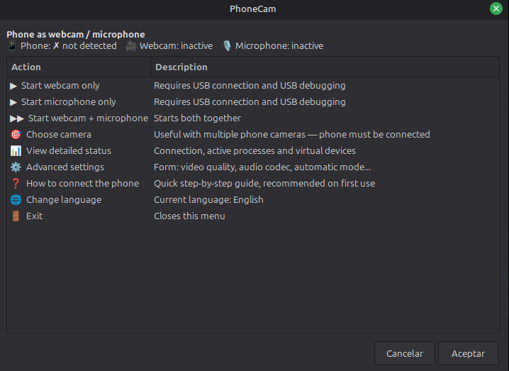
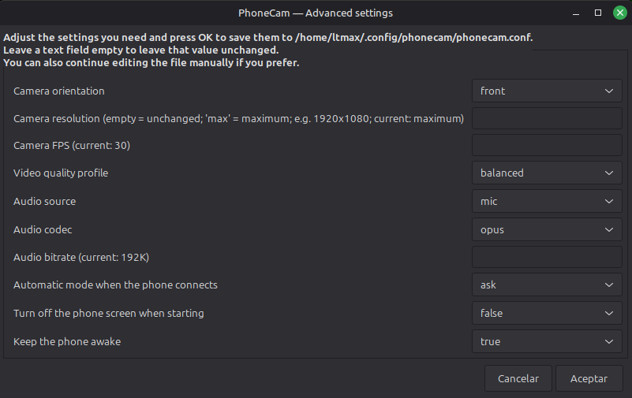
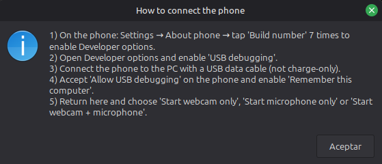

<p align="center">
  
</p>

# PhoneCam

[Español](README-es.md)

  

Turn your Android camera and microphone into an additional webcam and microphone on Linux Mint over USB. No app to install on the phone, no Wi-Fi, no cloud: everything stays between your phone and your PC.

> **Language:** PhoneCam includes its full interface in English and Spanish. It detects the system locale automatically (Spanish when applicable, English otherwise), and you can switch instantly with `L` in the text menu, from the language option in the graphical menu, or with `phonecam l`.

## What's new in 1.1.0

- **English and Spanish interface.** Menus, messages, installer and help now speak both languages and follow your system language. Switch any time with `phonecam l`, `L` in the text menu, or the graphical menu.
- **Safer scrcpy download.** The official build is checked against its SHA-256 checksum, and the archive is validated before it is extracted. The minimum scrcpy version is now **2.3.1** (it was 2.2).
- **Clearer failures.** Before starting, PhoneCam checks the phone's Android version (12+ for camera, 11+ for microphone) and requires audio to actually work. It then gives scrcpy 2 seconds (it was 1; adjustable with `PHONECAM_START_GRACE`) to prove it stays alive and, if it dies, shows the end of its log in the error instead of only pointing to the file.
- **Screen control through ADB.** `TURN_SCREEN_OFF` is applied through ADB because scrcpy disables control in camera mode; `KEEP_AWAKE` is applied the same way, and the phone's previous Android value is restored when capture ends.
- **More robust.** Configuration, launcher, service and PID files are now written atomically, so an interrupted write cannot leave a half-written file. The background agent also waits for your desktop session at login.
- **Also new:** `phonecam help-connection` (`ayuda` still works), the `mic-voice-recognition` audio source (scrcpy 3.2+), the app icon bundled inside the script, screenshots in both languages, and a regression test suite (`bash tests/run_all.sh`, no phone needed).

## What it is

For any program that lets you choose a camera or microphone — Zoom, Meet, Discord, OBS, Teams, your browser — your phone appears in the device list like any ordinary webcam, without that application needing to know anything special about PhoneCam or your phone.





Under the hood it combines three existing pieces and coordinates them from one script:

- **[scrcpy](https://github.com/Genymobile/scrcpy)** captures the phone camera and audio over USB.
- **v4l2loopback** exposes that capture as a normal `/dev/video*` device.
- **PipeWire/PulseAudio** exposes the audio as a normal virtual microphone.

PhoneCam does not reinvent any of that: it installs the pieces, connects them correctly, and puts a menu in front of you so you do not have to remember a single command.

Getting them to work together is more than "turning them on at the same time". When starting the webcam, PhoneCam asks scrcpy for the camera only — no screen, no remote control, so it avoids wasting resources — and sends it to the v4l2loopback device. When starting the microphone, it asks scrcpy for audio only and routes that audio stream to the virtual microphone; if automatic routing does not succeed within a few seconds, it tells you how to finish it manually in `pavucontrol`.

## Advantages

- **One self-contained script.** Installer, uninstaller, CLI, background agent, configuration template, `.desktop` launcher, `systemd --user` unit and even the application icon live in one `.sh`; the icon is the last block of the file (base64 inside comments, never executed), so a copy of the script on its own installs everything. `assets/` only holds the repository's images.
- **100% local.** No accounts, no cloud, no Wi-Fi between the phone and the PC: everything goes over USB through ADB (Android Debug Bridge). Once installed, it works without an internet connection.
- **Nothing to install on the phone.** There is no APK involved. PhoneCam uses Android's built-in USB debugging from Developer options.
- **It appears as real hardware.** The webcam is a standard `/dev/video*` device and the microphone is a normal PipeWire/PulseAudio device. Any program that can choose a camera or microphone sees them directly, without plugins or application-specific integrations.
- **It handles scrcpy for you.** The `scrcpy` package in Mint/Ubuntu repositories can lag behind the upstream features and version PhoneCam requires. So PhoneCam does not depend on that package: it checks the installed version and, if it is missing or too old, downloads the latest official release build from GitHub and leaves it ready in `~/.local/bin`, without sudo and without touching the rest of the system.
- **Automatic detection, with a system tray option.** A background agent watches the USB connection and starts (or asks, or ignores) the webcam and microphone according to the mode you choose; when the phone disconnects, it stops the capture. With `yad` installed it also adds a tray icon with quick access to everything. See [Automatic detection and system tray](#automatic-detection-and-system-tray).
- **The menu adapts to what is happening, instead of only telling you what failed.** In both the graphical (zenity) and text versions, the header shows at a glance whether the phone is connected and whether the webcam or microphone is active; options change automatically ("Stop webcam" instead of "Start" when it is already running, "Stop everything" only when there is something to stop), and each option tells you what the system needs before you use it. When something fails, the error appears in a window instead of disappearing into an unattended terminal; when it succeeds, you get a notification even if another window is in front.
- **The configuration is validated and applied immediately.** The advanced settings form checks resolution, FPS and audio bitrate before saving anything, so a typo does not turn into a cryptic scrcpy failure later. A saved change applies immediately to the current session; you do not need to close and reopen the menu.
- **Designed not to hang or trip over itself.** Every ADB call has a timeout, so a broken phone or a stuck `adb` server cannot freeze the menu or the agent. Before marking a webcam or microphone as active, it verifies that the PID still belongs to `scrcpy` rather than a different process; when stopping, it waits for the process to really exit before handing control back, so an immediate restart does not hit a still-busy device.
- **Installs and reinstalls without overwriting what you already had.** If the default video device number (`/dev/video42`) is already occupied by another camera or capture device, PhoneCam automatically chooses the next free one. Reinstalling reuses that number and the configuration you already had — it does not overwrite it — and also checks (and updates if needed) scrcpy.
- **Uninstalls carefully.** It removes the command, launcher, service and virtual microphone without touching system packages; it only removes the scrcpy symlink if it still points to the copy downloaded by PhoneCam (if you replaced it with your own scrcpy, it leaves it alone). It can even cleanly remove the script it is running from by relaunching first from a temporary copy. For the virtual webcam (which does require `sudo`) it prints the exact commands needed to revert it. See [Uninstall](#uninstall).
- **Works without a full graphical environment.** With `zenity` installed you get menus and forms; without it, PhoneCam falls back automatically to a fully functional text menu. No step becomes blocked only because a graphical helper is missing.

## Compatibility

- **Operating system:** designed and tested on Linux Mint 22.3 (Cinnamon). The installer relies on `apt`, so Ubuntu/Debian bases should behave the same; on distributions without `apt` (Fedora, Arch...) you will need to install dependencies manually and call the script directly, without `install`.
- **Architecture:** the automatic scrcpy download currently targets the official static Linux `x86_64` build. On other architectures you need to install scrcpy 2.3.1+ yourself; PhoneCam will use it once it is in `PATH`.
- **Phone:** any Android phone with USB debugging. scrcpy's camera mode requires Android 12 or newer and microphone capture requires Android 11 or newer — those are scrcpy limitations, not something PhoneCam can bypass. Below those versions, scrcpy may start but the webcam or microphone will not work. PhoneCam also requires scrcpy 2.3.1 or newer on the PC for both modes.
- **Privileges:** no root is needed on the phone. On the PC, `sudo` is requested only during installation (system packages, `v4l2loopback`, `video`/`plugdev` groups); everything else — including the scrcpy download — runs as a normal user, except when both `curl` and `wget` are missing and PhoneCam offers to install `curl` with `sudo`.

## Installation

```bash
git clone https://github.com/filonux/PhoneCam.git
cd PhoneCam/script
chmod +x phonecam.sh
./phonecam.sh install
```

Do not run it with `sudo`: the installer will ask for it only when it actually needs it. For an unattended installation (without questions, except for the system sudo password), use `./phonecam.sh install --yes`.

During installation, the script:

1. Installs the required packages with `apt`: `adb`, `curl`, `v4l2loopback-dkms`, `v4l-utils`, `pipewire`, `pipewire-pulse`, `wireplumber`, `pulseaudio-utils`, `zenity`, `yad`, `libnotify-bin` and the headers for the running kernel.
2. Downloads scrcpy (the official build, not the repository package) if you do not have it or the installed version is too old.
3. Configures `v4l2loopback` so the virtual webcam survives a reboot — if the default device number is already occupied by another camera or capture device, it automatically chooses the next free one — and adds your user to the `video` and `plugdev` groups when necessary.
4. Copies itself to `~/.local/bin/phonecam` and adds that directory to `PATH` if it is not already there.
5. Writes a default configuration (if you did not already have one), installs the custom 1024×1024 RGBA application icon, and creates the application launcher and `systemd --user` service that detects the phone automatically.

Two things to keep in mind:

- If it added you to the `video` or `plugdev` groups, you must **log out and back in** (or reboot) for the permission change to take effect — until then, `/dev/video42` (or whichever number was assigned) may exist but you will not be able to write to it.
- If your computer has **Secure Boot enabled**, this may be the first time a kernel module is compiled through DKMS: on the next boot you may see the blue "MOK Management" screen, where you simply accept enrollment of the new key.

Everything created by the installation lives here:

| What | Where |
| --- | --- |
| Installed command | `~/.local/bin/phonecam` |
| Configuration | `~/.config/phonecam/phonecam.conf` |
| Logs | `~/.local/share/phonecam/logs/` |
| Runtime state (PID files and per-mode startup locks) | `$XDG_RUNTIME_DIR/phonecam/` (or `~/.cache/phonecam/` without `XDG_RUNTIME_DIR`) |
| scrcpy downloaded by PhoneCam | `~/.local/share/phonecam/scrcpy/` |
| Application icon | `~/.local/share/icons/hicolor/1024x1024/apps/phonecam.png` |
| Application launcher | `~/.local/share/applications/phonecam.desktop` |
| Agent service | `~/.config/systemd/user/phonecam-agent.service` |

The icon is installed from `assets/phonecam-icon.png` when you install from the repository folder, and from the copy embedded in the script otherwise (an icon that is already installed is kept in that case). `assets/icon2.png` to `icon5.png` are alternative icons: copy one over the installed icon file to use it (reinstalling from the repository folder restores the default; reinstalling from the installed command keeps yours).

## Commands

Once installed, `phonecam` works like any other system command. If you prefer not to install it, the same thing works by running `./phonecam.sh <command>` from `script/`.

| Command | What it does |
| --- | --- |
| `phonecam` / `phonecam menu` | Opens the menu — graphical with `zenity`, text otherwise. This is what runs if you pass no command. |
| `phonecam webcam` | Starts only the phone camera as a webcam. |
| `phonecam mic` | Starts only the phone microphone. |
| `phonecam both` | Starts the camera and microphone together. |
| `phonecam stop` | Stops all PhoneCam processes. |
| `phonecam status` | Current status: phone connection, active processes, virtual devices. |
| `phonecam cameras` | Lists the cameras available on the phone. |
| `phonecam choose-cam` | Chooses and saves the default camera — useful when the phone has several. |
| `phonecam config` | Opens advanced settings (graphical form, or your editor if `zenity` is unavailable). |
| `phonecam help-connection` | Quick guide for connecting and authorizing the phone. `ayuda` and `help-conexion` still work as compatibility aliases. |
| `phonecam version` | Shows the installed version. |
| `phonecam install [--yes]` | Installs PhoneCam and its dependencies. |
| `phonecam uninstall` | Uninstalls PhoneCam. |
| `phonecam l` | Toggles the interface language between English and Spanish and saves the choice. |
| `phonecam help` (or `-h` / `--help`) | Lists the commands, with one line describing each. |

(`phonecam agent` also exists, but it is internal: it is launched by the `systemd --user` service created by the installer for automatic detection — see [Automatic detection and system tray](#automatic-detection-and-system-tray). You do not need to run it manually.)

## Connecting it for the first time

1. On the phone: **Settings → About phone**, tap "Build number" 7 times to enable Developer options.
2. Open Developer options and enable **USB debugging**.
3. Connect the phone to the PC with a **data-capable** USB cable (not every charging cable carries data).
4. On the phone, accept the "Allow USB debugging" prompt and enable "Remember this computer" so you do not have to repeat it.
5. Run `phonecam menu` (or `phonecam webcam` / `mic` / `both` directly).

From then on, in the application where you want to use it, select the device as you would any ordinary camera or microphone: the webcam should appear as **"PhoneCam"** (sometimes as "Dummy video device", depending on how the application reads it) and the microphone as **"PhoneMic"**.

If you have several phones connected at once, PhoneCam lets you choose which one to use in the graphical menu (the text menu uses the first one it finds and tells you); if the phone has several cameras (wide, front, etc.), `phonecam choose-cam` lets you set the one you want as the default.

The same guide is always available through `phonecam help-connection` (`ayuda` and `help-conexion` still work), or from the **"How to connect the phone"** option in the menu.

## Advanced settings

`phonecam config` opens a form (or the text file, if you do not have `zenity`) for `~/.config/phonecam/phonecam.conf`:

| Field | What it controls | Default |
| --- | --- | --- |
| `PHONECAM_LANG` | Interface language: `auto`, `en` or `es` | `auto` |
| `CAMERA_FACING` | Which camera to use by orientation: `back`, `front` or `external` | `back` |
| `CAMERA_ID` | Forces a specific camera ID (set by `phonecam choose-cam`; takes priority over `CAMERA_FACING`) | empty |
| `CAMERA_SIZE` | Resolution, in `WIDTHxHEIGHT` format (empty = the maximum declared by the phone) | empty |
| `CAMERA_FPS` | Frames per second | `30` |
| `VIDEO_QUALITY_PROFILE` | `balanced` (H.264, minimum latency, recommended for video calls) or `max` (H.265, better quality, slightly more decoding latency) | `balanced` |
| `AUDIO_SOURCE` | Phone audio source: `mic` or, with scrcpy 3.2+, `mic-unprocessed`, `mic-voice-communication`, `mic-voice-recognition` or `mic-camcorder` | `mic` |
| `AUDIO_CODEC` | Microphone codec: `opus`, `aac`, `flac` or `raw` | `opus` |
| `AUDIO_BITRATE` | Audio bitrate, e.g. `192K` | `192K` |
| `AUTO_MODE` | What to do when the phone connects: `ask`, `webcam`, `mic`, `both` or `off` | `ask` |
| `TURN_SCREEN_OFF` | Turns the phone screen off after capture starts | `false` |
| `KEEP_AWAKE` | Keeps the phone awake while PhoneCam is capturing, then restores its previous Android value | `true` |

The `.conf` file itself contains concise comments explaining each option — in the interface language active at the time it was written (English or Spanish) — so it can also be edited by hand without referring to this table. It also contains, although not in the form, the exact video bitrate values for each profile (`VIDEO_BITRATE_BALANCED` and `VIDEO_BITRATE_MAX`, 20M/30M by default), the virtual video device (`V4L2_DEVICE`) and the names of the virtual audio devices (`MIC_SINK_NAME`, `MIC_SOURCE_NAME`).

`KEEP_AWAKE=true` is applied through Android's `stay_on_while_plugged_in` setting and the original numeric value is restored after the last PhoneCam capture stops (or, if the phone was unplugged during a capture, by the agent as soon as it is back). `TURN_SCREEN_OFF=true` is handled through ADB because scrcpy disables control in camera mode; Android 15+ uses the display power command, while older supported versions use the power key only when the reported wakefulness is clearly active.

After launching scrcpy, PhoneCam keeps watching it for 2 seconds: if scrcpy exits on its own (camera in use, a setting the phone rejects...), the start fails and shows the last lines of its log in `~/.local/share/phonecam/logs/`, instead of reporting an active capture. The environment variable `PHONECAM_START_GRACE=SECONDS` changes that wait; `0` turns it off.

The form validates free-text fields — resolution, FPS and audio bitrate — before saving, so a bad value does not surface later as an opaque scrcpy failure; the remaining fields are combo boxes, so they cannot be left with an arbitrary invalid value. Configuration files are replaced atomically, so an interrupted write cannot leave a half-written `.conf` file. Saved changes apply immediately to the session where you made them; the background agent picks them up on the next phone connection.

## Automatic detection and system tray

The installation leaves an agent (`phonecam agent`, managed as a `systemd --user` service) active and watching the phone connection without requiring you to open the menu:

- It checks every 2 seconds for a phone authorized through ADB — local polling, with no network use at any point.
- When a new phone is detected, it acts according to `AUTO_MODE` (see the table below).
- When the phone disconnects, it stops any active capture and sends a notification.
- It picks up changes made through `phonecam config` or `choose-cam` on the next phone connection, without requiring a manual service restart.
- If it fails, `systemd` restarts it automatically.

| `AUTO_MODE` | What the agent does when the phone connects |
| --- | --- |
| `ask` (default) | Opens a small window asking whether you want webcam only, microphone only, both or nothing. Without `zenity`, it sends a notification asking you to open `phonecam menu`. |
| `webcam` / `mic` / `both` | Starts that mode directly, without asking. |
| `off` | Does nothing automatically; manual use through `phonecam` remains available. |

With `yad` installed, a system tray icon also appears with shortcuts to: open the full menu, webcam only, microphone only, webcam + microphone, view status, stop everything, open settings and exit — the last option stops the service for real instead of merely hiding the icon.

## Uninstall

```bash
phonecam uninstall
```

Do not run it with `sudo`: it refuses to start as root, just like the installer. It stops all processes, disables and removes the background agent, removes the installed command and launcher, releases the virtual microphone, and cleans logs and temporary files. It also removes the directory where it downloaded scrcpy (`~/.local/share/phonecam/scrcpy/`); the `~/.local/bin/scrcpy` symlink is removed only if it still points there, so if you replaced it with your own scrcpy, it is left alone. The only thing it asks about before deleting is the saved configuration in `~/.config/phonecam`; if you answer no, it remains there in case you reinstall later.

The virtual webcam is not reverted automatically because doing so requires `sudo`: the command prints the exact commands to run manually when you want to remove it.

```bash
sudo rm -f /etc/modprobe.d/phonecam-v4l2loopback.conf
sudo rm -f /etc/modules-load.d/phonecam-v4l2loopback.conf
sudo modprobe -r v4l2loopback
```

System packages (`v4l2loopback-dkms`, `pipewire`...) are not uninstalled either, because another application may use them; the command reminds you of that, while you can decide yourself what to remove with `apt` if you want a completely clean system.

## Plays well with Scriptya

[Scriptya](https://github.com/filonux/Scriptya) is another Filonux project: a menu that organizes your scripts into folders, launches them with fuzzy search, and can turn any of them — including `phonecam.sh` — into an independent app with its own icon in the application menu or on the desktop, without writing a `.desktop` file by hand.

You can point it at the `script/` folder in this repository and launch PhoneCam from there, or use `scriptya --icons` to install it as a separate app. Scriptya also reads optional metadata at the top of each script (menu name, description, confirmation requirements, whether it needs `sudo`...); `phonecam.sh` does not include that metadata yet, but it is a natural candidate for a future update.

## Language and roadmap

PhoneCam includes the full interface in English and Spanish: menus, prompts, status messages, forms, installer, uninstaller, notifications, help text, and the texts generated for the launcher and service. The script comments are kept in English and focus on behavior and safety rather than historical implementation notes.

By default, PhoneCam detects the locale from `LC_ALL`, `LC_MESSAGES` or `LANG`: if it starts with `es`, Spanish is used; in every other case, English is used. You can force the language in `~/.config/phonecam/phonecam.conf` with `PHONECAM_LANG="es"` or `PHONECAM_LANG="en"`, or return to automatic detection with `auto`. An exported `PHONECAM_LANG` takes priority over the file for that run, e.g. `PHONECAM_LANG=en phonecam status`, which is handy when reporting a bug.

For a quick switch, press `L` or `l` in the text menu, select **Change language** in the graphical menu, or run `phonecam l`. The choice is saved and used by later invocations.

**Mini-roadmap**, subject to real interest:

- [x] Translate the interface into English — the project started Spanish-only; it is now available in both Spanish and English (see [Language](#language-and-roadmap)).
- [ ] `.deb` package for one-click installation without `git clone`

If you are interested in an improvement, open an issue and say so — it is the simplest way to show that people are waiting for it.

## Testing

The project includes a focused regression suite covering the bilingual interface and the existing behavior. From the project root, run the complete suite:

```bash
bash tests/run_all.sh
```

It needs Bash 4.4 or newer and `python3` with Pillow (`python3-pil`), besides the usual tools of a desktop Linux; the full list is in [CONTRIBUTING](.github/CONTRIBUTING.md#test-requirements).

The suite covers locale precedence, automatic detection, persistent `en`/`es` switching, the `L`/`l` shortcut, GUI and terminal menu dispatch, camera discovery and selection, advanced configuration parsing and validation, webcam/microphone/both start and stop cycles, PipeWire/PulseAudio routing, V4L2 checks, scrcpy version and download fallbacks, atomic file replacement, Android API preflight, `--require-audio`, Android power-state handling, PID/lock safety, installation and uninstallation guards, the automatic agent, help output, error paths, and invariants on the arguments passed to the capture stack. It also renders the UI text with Linux fonts and runs a pseudo-TTY menu test plus an end-to-end simulated user journey with controlled external tools. `tests/walkthrough_en.sh`, included in that same run, goes a step further: it drives the real installed binary through a full non-root lifecycle — fresh machine, install, daily use, a language toggle, and uninstall — and checks the literal text printed at runtime rather than just how the message catalog is wired statically. The tests are designed to run without a physical phone or real system audio/video changes.

## Contributing

Issues and pull requests are welcome. There are templates for reporting bugs or proposing improvements, and the full guide is in [.github/CONTRIBUTING.md](.github/CONTRIBUTING.md). This project follows the code of conduct described in [.github/CODE_OF_CONDUCT.md](.github/CODE_OF_CONDUCT.md); for private security reports, see [.github/SECURITY.md](.github/SECURITY.md).

## License

See the [LICENSE](LICENSE.txt) file in this repository.

---

Made by **[Filonux](https://github.com/filonux)**.
